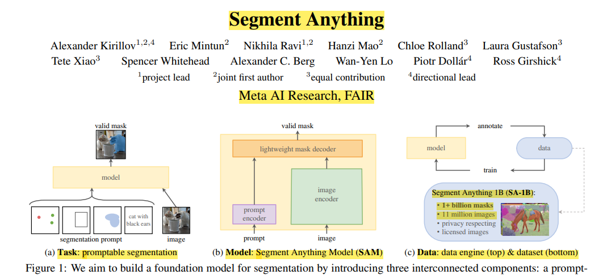
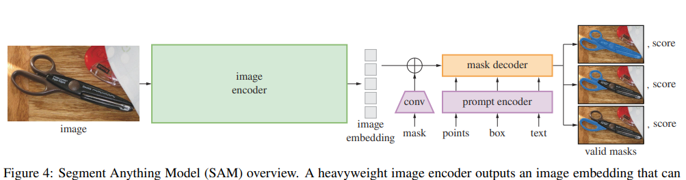
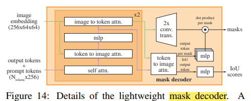
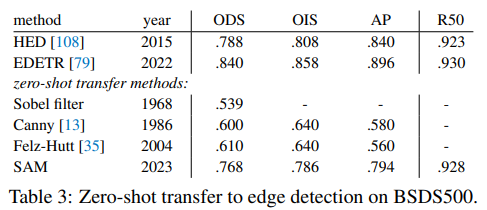
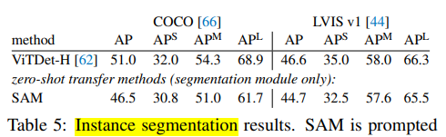
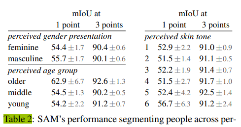

## 技術摘要

#### 資訊來源

- Title: Segment Anything
- 論文: https://scontent.ftpe8-2.fna.fbcdn.net/v/t39.2365-6/10000000_900554171201033_1602411987825904100_n.pdf?_nc_cat=100&ccb=1-7&_nc_sid=3c67a6&_nc_ohc=wNkFGThcmjwAb4N5Rbd&_nc_ht=scontent.ftpe8-2.fna&oh=00_AfAM_b3vi2wR6i2fuvZlon9T-WeeqovYVvd0tBr7e7_bgA&oe=662E9827
- Arxiv: https://arxiv.org/abs/2304.02643
- Github: https://github.com/facebookresearch/segment-anything

#### 發表資訊

- 發表期刊/會議: ICCV 2023
- arxiv 發表年月: 202304
- 作者所屬學校/機構: Meta AI Research, FAIR

#### 研究貢獻

- 研究目標背景知識: 開發基於大規模數據的強大零擊中(image segmentation)基礎模型，使用提示(prompt)進行訓練，以達到零擊中轉移到多個下游任務的能力。
- 研究目標: 建立一個可通過提示進行即時影像分割的基礎模型，並能夠在沒有進一步訓練的情況下適用於新的任務和數據分佈。
- 資料集描述: 使用名為SA-1B的數據集，包括超過11M張圖片和1B個掩碼，這些圖片和掩碼均已取得授權且尊重隱私。
- 關鍵發現: SAM（Segment Anything Model）可以從單一前景點提示中產生高質量的掩碼，這些掩碼的質量接近手動標註的地面真相。
- 研究結果比較: 與當前的基於完全監督學習的模型相比，SAM在多數資料集上的表現接近或超越這些模型，尤其是在零擊中設定中表現出色。

#### 模型

- 理論架構和設計: 本文提出一種新的基於提示的影像分割任務，透過提示工程來實現對新的任務和數據分佈的零擊中遷移。
- 模型資訊_architecture: Segment Anything Model (SAM)

  
- 模型資訊_backbone: 使用Vision Transformer (ViT)作為影像編碼器

#### 論文截錄

- Abstract: We introduce the Segment Anything (SA) project: a new task, model, and dataset for image segmentation. Using our efficient model in a data collection loop, we built the largest segmentation dataset to date (by far), with over 1 billion masks on 11M licensed and privacy respecting images. The model is designed and trained to be promptable, so it can transfer zero-shot to new image distributions and tasks. We evaluate its capabilities on numerous tasks and find that its zero-shot performance is impressive -- often competitive with or even superior to prior fully supervised results. We are releasing the Segment Anything Model (SAM) and corresponding dataset (SA-1B) of 1B masks and 11M images at this https URL to foster research into foundation models for computer vision.
- metrics & experiments:

  
  Zero-shot表現就足以compete先前方法

  

  即便SAM在自動評估的精度指標上略低於ViTDet，在人類評估中的表現卻更受青睞。

  原文: To investigate this observation, we conducted an additional human study asking annotators to rate the ViTDet masks and SAM masks on the 1 to 10 quality scale used before. In Fig. 11 we observe that SAM consistently outperforms ViTDet in the human study.

  

  使用3 points表現更佳
- Ablation study: 在不同資料量和不同訓練資料組合下，SAM（Segment Anything Model）模型在影像分割任務上的表現。

  - We observe that each stage increases mIoU. 說明了透過資料引擎的不同階段累積訓練資料時，每個階段都能觀察到 mIoU的提升。
  - 數據量對效能的影響：分析了全量資料 SA-1B（包含 11M 影像）與減少到 1M 和 0.1M 影像時的性能差異
    - 在僅有 0.1M 影像的設定下，觀察到顯著的 mIoU 下降。
    - 使用 1M 影像（約佔全量資料的 10%）時，效能與使用全量資料相當。
  - 數據減少的實用性考量：即使在資料量減少到大約 1M 影像的情況下，由於仍包含約 100M 遮罩，這樣的資料配置對於許多使用情境來說可能是實際可行的。
- conclusion & keywords & keypoints:

  - foundation models
  - promptable segmentation
  - data engine: Semi-automatic stage
  - SA-1B. SA-1B contains 11M diverse, high-resolution, licensed, and privacy protecting images and 1.1B high-quality segmentation masks.
  - Efficiency、real-time
  - MAE、ViT
  - CLIP
  - Zero-Shot

## Segment Anything with SAM

#### Introduction

This script allows users to perform object segmentation on images using different input methods like points, bounding boxes, or a combination of both with the SAM model.

#### Dependencies

- Python 3.8+
- NumPy
- Matplotlib
- OpenCV
- Torch
- torchvision
- segment_anything

#### Installation

Ensure you have the required dependencies:

```bash
pip install numpy matplotlib opencv-python torch torchvision
```

#### Examples

**Segment with Points**

```bash
python SAM.py --input_point '100,100;110,110;0,0' --input_label '1,1,0' --image_path './path/to/your/image.jpg'
```

**Segment with Bounding Box**

```bash
python SAM.py --input_box '10,100,300,300' --image_path './path/to/your/image.jpg'
```

**Segment with Points and Bounding Box**

```bash
python SAM.py --input_point '100,100;110,110;0,0' --input_label '1,1,0' --input_box '10,100,300,300' --image_path './path/to/your/image.jpg'
```

#### Docker

docker build -t segmentation-app .
docker run -it --rm segmentation-app

#### Related work


## 技術摘要

#### 資訊來源

- Title: Segment Anything
- 論文: https://scontent.ftpe8-2.fna.fbcdn.net/v/t39.2365-6/10000000_900554171201033_1602411987825904100_n.pdf?_nc_cat=100&ccb=1-7&_nc_sid=3c67a6&_nc_ohc=wNkFGThcmjwAb4N5Rbd&_nc_ht=scontent.ftpe8-2.fna&oh=00_AfAM_b3vi2wR6i2fuvZlon9T-WeeqovYVvd0tBr7e7_bgA&oe=662E9827
- Arxiv: https://arxiv.org/abs/2304.02643
- Github: https://github.com/facebookresearch/segment-anything

#### 發表資訊

- 發表期刊/會議: ICCV 2023
- arxiv 發表年月: 202304
- 作者所屬學校/機構: Meta AI Research, FAIR

#### 研究貢獻

- 研究目標背景知識: 開發基於大規模數據的強大零擊中(image segmentation)基礎模型，使用提示(prompt)進行訓練，以達到零擊中轉移到多個下游任務的能力。
- 研究目標: 建立一個可通過提示進行即時影像分割的基礎模型，並能夠在沒有進一步訓練的情況下適用於新的任務和數據分佈。
- 資料集描述: 使用名為SA-1B的數據集，包括超過11M張圖片和1B個掩碼，這些圖片和掩碼均已取得授權且尊重隱私。
- 關鍵發現: SAM（Segment Anything Model）可以從單一前景點提示中產生高質量的掩碼，這些掩碼的質量接近手動標註的地面真相。
- 研究結果比較: 與當前的基於完全監督學習的模型相比，SAM在多數資料集上的表現接近或超越這些模型，尤其是在零擊中設定中表現出色。

#### 模型

- 理論架構和設計: 本文提出一種新的基於提示的影像分割任務，透過提示工程來實現對新的任務和數據分佈的零擊中遷移。
- 模型資訊_architecture: Segment Anything Model (SAM)

  
- 模型資訊_backbone: 使用Vision Transformer (ViT)作為影像編碼器

#### 論文截錄

- metrics & experiments:

  
  Zero-shot表現就足以compete先前方法

  

  即便SAM在自動評估的精度指標上略低於ViTDet，在人類評估中的表現卻更受青睞。

  原文: To investigate this observation, we conducted an additional human study asking annotators to rate the ViTDet masks and SAM masks on the 1 to 10 quality scale used before. In Fig. 11 we observe that SAM consistently outperforms ViTDet in the human study.

  

  使用3 points表現更佳
- Ablation study: 在不同資料量和不同訓練資料組合下，SAM（Segment Anything Model）模型在影像分割任務上的表現。

  - We observe that each stage increases mIoU. 說明了透過資料引擎的不同階段累積訓練資料時，每個階段都能觀察到 mIoU的提升。
  - 數據量對效能的影響：分析了全量資料 SA-1B（包含 11M 影像）與減少到 1M 和 0.1M 影像時的性能差異
    - 在僅有 0.1M 影像的設定下，觀察到顯著的 mIoU 下降。
    - 使用 1M 影像（約佔全量資料的 10%）時，效能與使用全量資料相當。
  - 數據減少的實用性考量：即使在資料量減少到大約 1M 影像的情況下，由於仍包含約 100M 遮罩，這樣的資料配置對於許多使用情境來說可能是實際可行的。
- conclusion & keywords & keypoints:

  - foundation models
  - promptable segmentation
  - data engine: Semi-automatic stage
  - SA-1B. SA-1B contains 11M diverse, high-resolution, licensed, and privacy protecting images and 1.1B high-quality segmentation masks.
  - Efficiency、real-time
  - MAE、ViT
  - CLIP
  - Zero-Shot

## Segment Anything with SAM

#### Introduction

This script allows users to perform object segmentation on images using different input methods like points, bounding boxes, or a combination of both with the SAM model.

#### Dependencies

- Python 3.8+
- NumPy
- Matplotlib
- OpenCV
- Torch
- torchvision
- segment_anything

#### Installation

Ensure you have the required dependencies:

```bash
pip install numpy matplotlib opencv-python torch torchvision
```

#### Examples

**Segment with Points**

```bash
python SAM.py --input_point 100,100;110,110;0,0 --input_label 1,1,0 --image_path ./test_data/cat.jpg
```

**Segment with Bounding Box**

```bash
python SAM.py --input_box 10,10,450,300 --image_path ./test_data/cat.jpg
```

**Segment with Points and Bounding Box**

```bash
python SAM.py --input_point 100,100;110,110;0,0 --input_label 1,1,0 --input_box 10,10,450,300 --image_path ./test_data/cat.jpg
```

#### Docker

docker build -t segmentation-app .
docker run -it --rm segmentation-app

#### Background


#### Related works

Segmentation 大全

* [https://github.com/luca-medeiros/lang-segment-anything](https://github.com/luca-medeiros/lang-segment-anything?fbclid=IwZXh0bgNhZW0CMTAAAR2_s3bhCzjAnW-kPcv61WrVCsqxQ-FN1c-tP9IX8HNitUI3Bu_-TYe6Eb4_aem_AeC3VawyynvsCJ11j17J-tw6T3K85vInDj_BQAsnSjZg6kpRMKCFB63k8ijYSQyDGk4VDkWk8S8pQHPk0vInGBqA)
* [https://github.com/halleewong/ScribblePrompt](https://l.facebook.com/l.php?u=https%3A%2F%2Fgithub.com%2Fhalleewong%2FScribblePrompt%3Ffbclid%3DIwZXh0bgNhZW0CMTAAAR372p2ggWzzAHNzcVMaI7PYwtnqpRZpS98qrSVutoV4xfPhT3aDpGRlRKY_aem_AeC_ndLivMfSRo33DXN0qNc4AbnpNOqvV7svwYnc59xMMefTd7LwL_2YWj2927JGS17JF11utjsn5CFApYhSERgQ&h=AT3TiaIR6VpDjA6zoCKIrRGpSSPZt0mT8mA7GxND55rVIMmBAYLemEtrajmtVJrxW_FWluz1ODMbpB27TO0DAUomgiUEF7YjUCzoKU5LQXEE_jwKvVGWTzeRni471W_kEfLkQU9OzHwuBtBJLFP0gw)
* [https://github.com/Hedlen/awesome-segment-anything?tab=readme-ov-file](https://github.com/Hedlen/awesome-segment-anything?tab=readme-ov-file&fbclid=IwZXh0bgNhZW0CMTAAAR1e7D9DYNNgbHQ1jn4pm-1kinFtxXfVAvk-nvK06_URCIipyXfdhyl8RJ0_aem_AeCRzMLV9xgcQeOsjOdFf4Odara0Xmy3Rfx2ZhmUBePn_UNonk4ZPEq3UzwAf1uIXcg0DoE_Zu8x4vWobdsGv0GL)
* [https://github.com/qubvel/segmentation\_models.pytorch?tab=readme-ov-file#start](https://github.com/qubvel/segmentation_models.pytorch?tab=readme-ov-file&fbclid=IwZXh0bgNhZW0CMTAAAR3OThmqRTGUpe5zZ_L037mFRg0uRiSZotzV8ZALyUmC1w_RsjUhEjSLJ_w_aem_AeCAgYAIPVz5NtM0n-7nytwVjvvr66bYcOXay4_dYVs_jNnWvEQB4es8y49qLNA8V0KPp4PqY9tl5mghL-ckRoG5#start)  [(https://github.com/qubvel/segmentation_models.pytorch?tab=readme-ov-file&fbclid=IwZXh0bgNhZW0CMTAAAR2N2tLGWmZzkZ7xDGHCg-XlNGXvN0ZlwDKYtRKoOPdcaXxCpmapsONwba8_aem_AeDOMR_dOO11c1QuDiDTlBXSwE7HQgMKM_WMFmkXmWe_33_KMtuxmvC1z1WEiLRh8SyGF8YupOy5TUJN84xzfwtp#start)
* [arxiv.org/pdf/2403.09620.pdf?fbclid=IwZXh0bgNhZW0CMTAAAR0EaJbNoIxLL66HKHxsCo\_TWD4fn9J6Dk4r5mMsBEzvi8usDaEdxpnyX7A\_aem\_AeCfOsn4BWCCuT6vsq-oOQtmX9nPZILknp9\_UBGiChhxv7IGAjJhWh3yD8pUcY5UI1tlU1UbJGWfr9lXv19vNuxZ](https://arxiv.org/pdf/2403.09620.pdf?fbclid=IwZXh0bgNhZW0CMTAAAR0EaJbNoIxLL66HKHxsCo_TWD4fn9J6Dk4r5mMsBEzvi8usDaEdxpnyX7A_aem_AeCfOsn4BWCCuT6vsq-oOQtmX9nPZILknp9_UBGiChhxv7IGAjJhWh3yD8pUcY5UI1tlU1UbJGWfr9lXv19vNuxZ)
